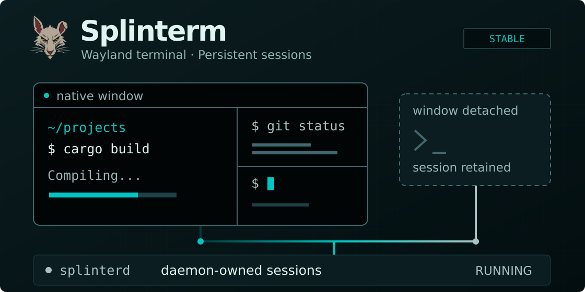
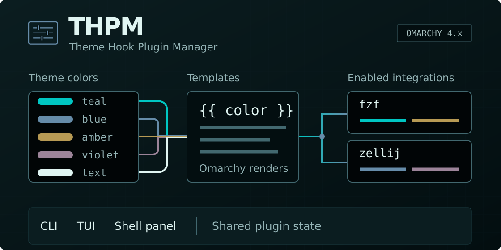
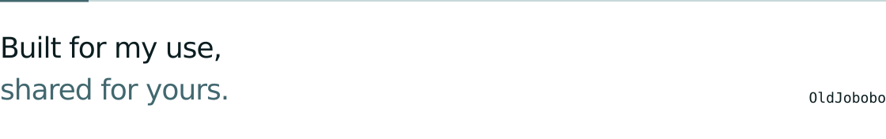

  

  
  
  
  

# OldJobobo

### I make things I want to use, fix things that bother me, and share what comes out of it.

 

<h2>
  <picture>
    <source media="(prefers-color-scheme: dark)" srcset="assets/section-featured-dark.svg" />
    
  </picture>
</h2>

<table width="100%">
  <tr>
    <td>
      
      
<strong>A Wayland terminal with persistent, daemon-owned shell sessions. Shells keep running when the window closes.</strong> Native Wayland windows, tabs, and split panes, with JSON/NDJSON, SSH relay, and MCP interfaces for authorized tools.

      

        
        
        &nbsp; <a href="https://github.com/OldJobobo/splinterm">View repository ↗</a>
      

    </td>
  </tr>
</table>

<table width="100%">
  <tr>
    <td>
      
      
<strong>Manage integrations from the CLI, TUI, or Omarchy Shell panel.</strong> Uses Omarchy's color resolver and templates. Integrations are opt-in for new installs; support status is documented per integration.

      

        
        
        &nbsp; <a href="https://github.com/OldJobobo/thpm">View repository ↗</a>
      

    </td>
  </tr>
</table>

 

<h2>
  <picture>
    <source media="(prefers-color-scheme: dark)" srcset="assets/section-themes-dark.svg" />
    
  </picture>
</h2>

<table width="100%">
  <tr>
    <td width="33%" align="center" valign="top">
      <a href="https://github.com/OldJobobo/omarchy-miasma-theme">
        
         Miasma ↗
      </a>
    </td>
    <td width="33%" align="center" valign="top">
      <a href="https://github.com/OldJobobo/omarchy-lumon-theme">
        
         Lumon ↗
      </a>
    </td>
    <td width="33%" align="center" valign="top">
      <a href="https://github.com/OldJobobo/omarchy-retro-82-theme">
        
         Retro 82 ↗
      </a>
    </td>
  </tr>
  <tr>
    <td width="33%" align="center" valign="top">
      <a href="https://github.com/OldJobobo/omarchy-sakura-mochi-theme">
        
         Sakura Mochi ↗
      </a>
    </td>
    <td width="33%" align="center" valign="top">
      <a href="https://github.com/OldJobobo/omarchy-event-horizon-theme">
        
         Event Horizon ↗
      </a>
    </td>
    <td width="33%" align="center" valign="top">
      <a href="https://github.com/OldJobobo/omarchy-last-call-theme">
        
         Last Call ↗
      </a>
    </td>
  </tr>
</table>

Miasma is included in the official Omarchy theme collection. [Full theme gallery ↗](THEMES.md)

 

<h2>
  <picture>
    <source media="(prefers-color-scheme: dark)" srcset="assets/section-projects-dark.svg" />
    
  </picture>
</h2>

<!-- profile:projects:start -->
<table width="100%">
  <tr>
    <td width="50%" valign="top">
      <h3><a href="https://github.com/OldJobobo/jobo-themes">jobo-themes ↗</a></h3>
      
Catalog-backed installer for complete OldJobobo Omarchy themes, including executable configurations. Install only themes you trust.

    </td>
    <td width="50%" valign="top">
      <h3><a href="https://github.com/OldJobobo/based">based ↗</a></h3>
      
Base16/Base24 colorscheme editor.

    </td>
  </tr>
  <tr>
    <td width="50%" valign="top">
      <h3><a href="https://github.com/OldJobobo/jobowalls">jobowalls ↗</a></h3>
      
An Alternative Wallpaper Picker/Manager for Omarchy

    </td>
    <td width="50%" valign="top">
      <h3><a href="https://github.com/OldJobobo/collago">collago ↗</a></h3>
      
A Declarative Collage Wallpaper Generator written in Go

    </td>
  </tr>
  <tr>
    <td width="50%" valign="top">
      <h3><a href="https://github.com/OldJobobo/arcana">arcana ↗</a></h3>
      
A local-first tarot reading plugin for Omarchy and Quattro, with a deterministic interpretation engine.

    </td>
    <td width="50%" valign="top">
      <h3><a href="https://github.com/OldJobobo/omatype">omatype ↗</a></h3>
      
Offline, keyboard-first typing practice for the Omarchy Quattro shell.

    </td>
  </tr>
  <tr>
    <td width="50%" valign="top">
      <h3><a href="https://github.com/OldJobobo/pi-skill-manager">pi-skill-manager ↗</a></h3>
      
Interactive skill context controls and presets for the Pi coding agent

    </td>
    <td width="50%" valign="top">
      <h3><a href="https://github.com/OldJobobo/lacuna-shell">lacuna-shell ↗</a></h3>
      
A Shell Extension Suite for Omarchy

    </td>
  </tr>
</table>
<!-- profile:projects:end -->

[All repositories ↗](https://github.com/OldJobobo?tab=repositories)

 

<table width="100%">
  <tr>
    <td width="50%" valign="top">
      <h3>What I work on</h3>
      <ul>
        <li>Omarchy themes, color systems, and desktop integrations</li>
        <li>Terminal sessions, shell tooling, and automation</li>
        <li>Base16/Base24 palettes, VS Code themes, and Neovim colorschemes</li>
        <li>Wallpaper tools and desktop experiments</li>
      </ul>
    </td>
    <td width="50%" valign="top">
      <h3>Core stack</h3>
      
<strong>Tools</strong> <code>Pi</code> <code>Codex</code> <code>Claude</code> <code>Hermes</code> <code>Aether</code> <code>GoWall</code> <code>GIMP</code> <code>Neovim</code>

      
<strong>Languages</strong> <code>Rust</code> <code>Go</code> <code>Python</code> <code>Bash</code> <code>Lua</code> <code>TypeScript</code> <code>CSS</code> <code>HTML</code> <code>C#</code>

    </td>
  </tr>
</table>

### Issues and contributions

Use the relevant repository's Issues page. Include your environment and tool versions, steps to reproduce, expected and actual behavior, and relevant logs or screenshots. Check each project's requirements for compatibility.

For feature requests, describe the user problem first, then the proposed behavior.

### Supporters

Thank you to these public Ko-fi supporters:

DHH · HANCORE · perfekt · Straight Classy · twodogs · SqdnGunny

  

 

<picture>
  <source media="(prefers-color-scheme: dark)" srcset="assets/footer-dark.svg" />
  
</picture>
